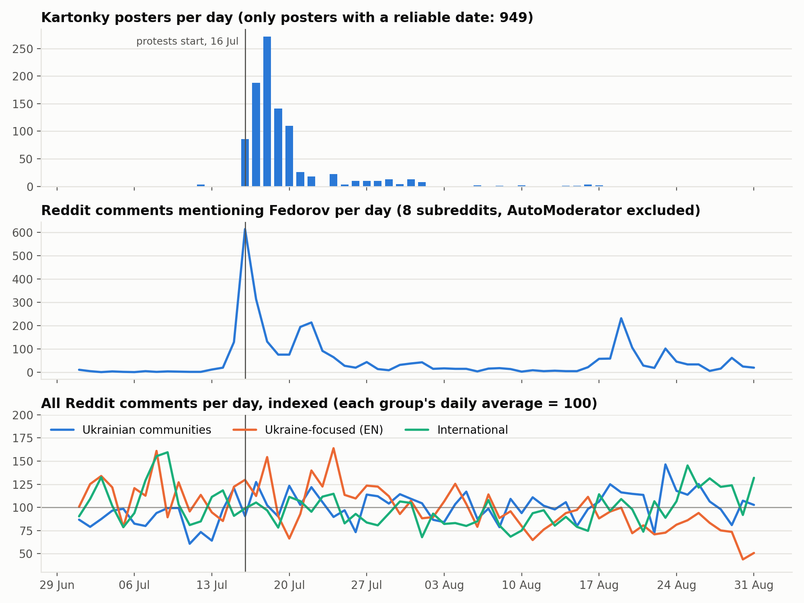

# Kartonky × Reddit: offline vs online protest discourse (July 2026)

Computational Social Science course, NaUKMA Faculty of Informatics, 2026.
Team 7: Yaroslav Smakorovskyi (lead), Veronika Kachai, Anton Pihuliak.

In July 2026 people in Ukraine went out with cardboard posters ("картонки") after
Fedorov's dismissal from the Ministry of Defence. This project compares what was
written **offline**, on the posters, with what was discussed **online**, on Reddit,
and later with the daily news.

| | |
|---|---|
| Dataset | Google Drive, view-only: `clean/` (0.66 GB), `raw_filtered/` (1.23 GB), `kartonky_author_export/`. The link is shared with the course in our homework reports |
| Video pitch | _TBD_ |
| Contribution to the course tool | [reddit-dump-extractor PR #2](https://github.com/SanGreel/reddit-dump-extractor/pull/2): ~2.2× faster, −62% memory, identical output |

## First look



Reddit comments mentioning Fedorov rise to 129 on 15 July, the day before the
protests, and peak at 614 on 16 July, the start day. Posters with a reliable
date peak two days later (272 on 18 July). Total comment volume barely moves:
the event changes *what* people discuss, not *how much*. Details are in
[`notebooks/01_dataset_overview.ipynb`](notebooks/01_dataset_overview.ipynb).

## Data

| Source | What | Period | Rows (clean) |
|---|---|---|---|
| [Kartonky](https://kartonky.propellercrew.com) archive | protest posters: text, text origin (typed / OCR), self-reported city, dates, likes | 16.07–17.08.2026 | 4,448 |
| Reddit submissions (Pushshift-format monthly dumps: [2026-07](https://academictorrents.com/details/e04a4fda12826ab1d181eef6512b36aca63c70ff), [2026-08](https://academictorrents.com/details/f4848163a5fb650e4b15eee0202858447bca120a)) | posts from 8 subreddits | July–August 2026 | 34,424 |
| Reddit comments (same dumps) | comments from 8 subreddits | July–August 2026 | 1,467,671 |

**Size:** 1.23 GB of filtered Reddit data (all fields) → 0.66 GB of clean CSVs.

**Subreddits** ([`config/subreddits.txt`](config/subreddits.txt)) were chosen by a
keyword scan of both monthly submission dumps
([scan report](reports/subreddit_scan_report.md)), in three groups:

- Ukrainian communities: reddit_ukr, RedditUATalks, Kyiv
- Ukraine-focused, in English: ukraine, UkrainianConflict
- International: worldnews, europe, UkraineRussiaReport

**Why July–August only.** The event is local in time: the question is about the
day before the protests, the start day (16.07) and the following days. Two
months give a two-week baseline before and six weeks after.

**Ethics.** Poster photos are not redistributed (the archive author's condition:
publish analysis, not images). No data and no link to it are stored in this repo:
data collected for the course stays within the course.

**Citation.** «Картонки: народна галерея протестних плакатів» [онлайн-архів],
автор Артем Сах, 2026, https://kartonky.propellercrew.com

## Pipeline

| Step | Code | Output |
|---|---|---|
| 1. Kartonky, first pass: own scraper over the site API (4,436 posters) + photo downloader (local only) | `scripts/kartonky_scraped/` | `data/kartonky_scraped/2026-09-18/` |
| 2. Kartonky cleaning of the author's official export: year typo fix, one best date per poster (EXIF > event date > upload time) with a reliability flag, Kyiv-local day, cities normalized (100 → 93), slogan counts, possible re-uploads flagged | `scripts/kartonky_author_export/clean_kartonky.py` | `data/clean/kartonky_clean.csv` + `cleaning_log.txt` |
| 3. Subreddit scan: stream both submission dumps (~91M posts), count keyword hits per subreddit, rank and flag noise (bots, Indian protests, "Protestant" in religious subs) | `scripts/reddit/run_scan.sh`, `scan_subreddits.py`, `analyze_scan.py` | `data/reddit_scan/`, [`reports/subreddit_scan_report.md`](reports/subreddit_scan_report.md) |
| 4. Reddit extraction: filter dumps by subreddit (739M comment + 91M submission lines) | [reddit-dump-extractor](https://github.com/SanGreel/reddit-dump-extractor) with [PR #2](https://github.com/SanGreel/reddit-dump-extractor/pull/2) | `data/reddit_raw/` (1.23 GB) |
| 5. Reddit cleaning: analysis columns, duplicate ids, UTC + Kyiv-local dates, flags for removed text / deleted author / AutoModerator / top-level (flagged, not dropped) | `scripts/reddit/clean_reddit.py` | `data/clean/reddit_*.csv` + `reddit_cleaning_log.txt` |
| 6. Exploration (H2 Task 2): sizes, row counts, breakdown by type, frequencies, activity per day | `notebooks/01_dataset_overview.ipynb` | `reports/figures/` |

Every step writes a log with counts, so each number above can be traced.

## Reproduce

### Setup

```bash
brew install zstd ripgrep pv          # Linux: apt install zstd ripgrep pv
python3 -m venv .venv && source .venv/bin/activate
pip install -r requirements.txt

# extraction tool, with our improvements (until PR #2 is merged)
git clone -b perf/prefilter-streaming https://github.com/smaknomercy/reddit-dump-extractor tools/reddit-dump-extractor
python3 -m venv tools/reddit-dump-extractor/venv
tools/reddit-dump-extractor/venv/bin/pip install zstandard orjson pandas pyarrow psutil
```

### 0. Download the data

- **Reddit:** two monthly torrents on Academic Torrents,
  [Reddit comments/submissions 2026-07](https://academictorrents.com/details/e04a4fda12826ab1d181eef6512b36aca63c70ff) (80.3 GB) and
  [Reddit comments/submissions 2026-08](https://academictorrents.com/details/f4848163a5fb650e4b15eee0202858447bca120a) (74.6 GB).
  Place the files like this:
  ```
  reddit_07/submissions/RS_2026-07.zst   23.2 GB
  reddit_07/comments/RC_2026-07.zst      57.1 GB
  reddit_08/submissions/RS_2026-08.zst   23.1 GB
  reddit_08/comments/RC_2026-08.zst      51.5 GB
  ```
- **Kartonky:** the official export was received from the archive author on request →
  `data/kartonky_author_export/2026-09-21/kartonky-corpus-2026-09-21.csv`.
  The public scraper (step 1) is in `scripts/kartonky_scraped/`
  (run inside `data/kartonky_scraped/<date>/`).

### 1–6. Run

```bash
# 2. Kartonky cleaning
python scripts/kartonky_author_export/clean_kartonky.py

# 3. Subreddit scan (~6 min per month), then ranking
for m in 07 08; do
  scripts/reddit/run_scan.sh reddit_$m/submissions/RS_2026-$m.zst data/reddit_scan/subreddit_hits_2026-$m.csv
done
python scripts/reddit/analyze_scan.py        # -> data/reddit_scan/scan_report.md

# 4. Extraction (submissions: ~7 min per month; comments: ~28 min, both months in parallel)
cd tools/reddit-dump-extractor && source venv/bin/activate
SUBS="$(paste -sd, ../../config/subreddits.txt)"
for m in 07 08; do
  python reddit_zst_filter_zstandard.py ../../reddit_$m --file_filter "^RS_" --value "$SUBS" \
    --output_dir ../../data/reddit_raw
  python reddit_zst_filter_zstandard.py ../../reddit_$m --file_filter "^RC_" --value "$SUBS" \
    --fields "$(paste -sd, ../../config/comment_fields.txt)" --output_dir ../../data/reddit_raw
done
deactivate && cd ../..

# 5. Reddit cleaning (~2 min)
python scripts/reddit/clean_reddit.py

# 6. Open notebooks/01_dataset_overview.ipynb and Run All (~15 s)
```

`notebooks/_build_notebook.py` regenerates the notebook from code.

## Layout

```
config/
  subreddits.txt             the 8 selected subreddits
  comment_fields.txt         82 comment fields kept at extraction
scripts/
  kartonky_scraped/          our scraper (site API) + photo downloader
  kartonky_author_export/    cleaning of the author's export
  reddit/                    subreddit scan + ranking, Reddit cleaning
notebooks/                   Task 2 exploration (+ generator script)
reports/
  figures/                   charts from the notebook, DataFrame screenshot
  subreddit_scan_report.md   why these 8 subreddits
  H*_7.*       (gitignored)  homework reports, submitted to the course
data/          (gitignored)  raw + clean data, logs
images/        (gitignored)  poster photos, local only
reddit_07/, reddit_08/ (gitignored)  Pushshift dumps
tools/         (gitignored)  reddit-dump-extractor clone
```
